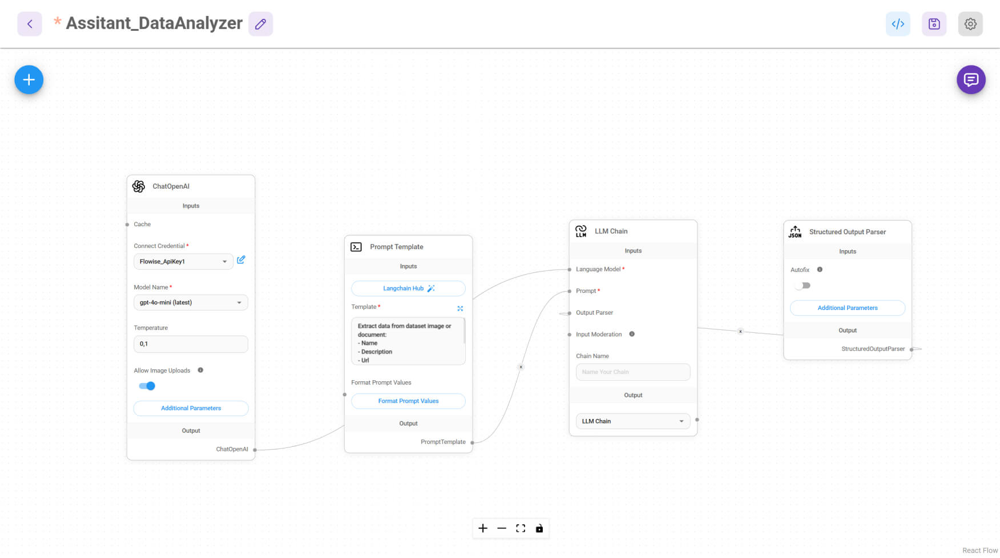

Flowise AI Agent - Assistant DataAnalyzer

Overview

This Flowise AI Agent is designed to analyze and extract structured data from datasets, images, and documents. It leverages OpenAI's GPT-4o model, LangChain-based prompt templates, and structured output parsing to ensure accurate and consistent results. Additionally, it includes self-improvement mechanisms and verification steps to enhance the quality of generated content.

Workflow Breakdown

The agent consists of the following nodes:

1. ChatOpenAI (OpenAI GPT-4o Model)

2. Prompt Template (LangChain Template Processing)

3. LLM Chain (Processing and Self-Improvement)

4. Structured Output Parser (JSON Validation & Final Check)

Features

Automated Data Extraction: Extracts structured information from datasets and documents.

Self-Improvement: Iteratively refines prompts and responses.

Output Verification: Ensures consistency and correctness using structured parsing.

Modular & Scalable: Can be extended with additional processing steps and APIs.

How to Use

Clone this repository:

git clone https://github.com/your-repo/flowise-ai-agent.git

Install Flowise locally:

npm install -g flowise

Start Flowise:

flowise start

Open Flowise at localhost:3000 and import the provided JSON flow.

Configure API keys and parameters.

Run the agent and test its output.

Future Enhancements

Integration with OCR: To support image-based data extraction.

Enhanced Moderation: More refined filtering of input data.

Feedback Loop: To continuously improve outputs based on past interactions.

License

MIT License

Author

Piotr Macai
